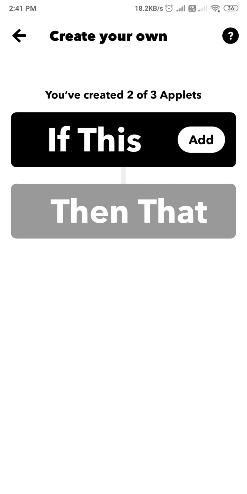
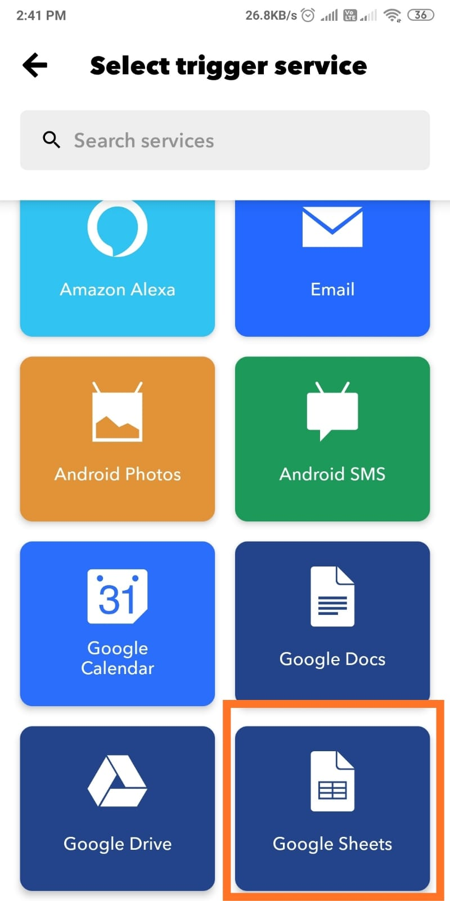
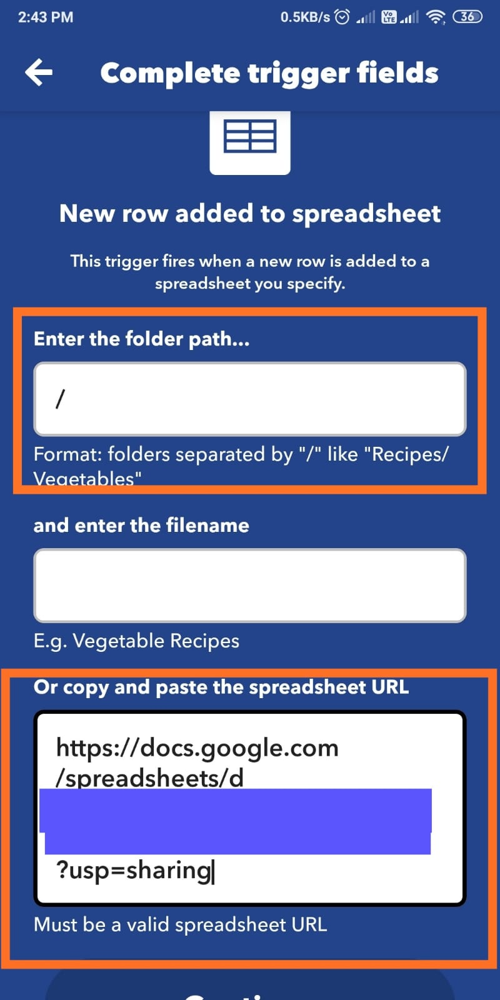
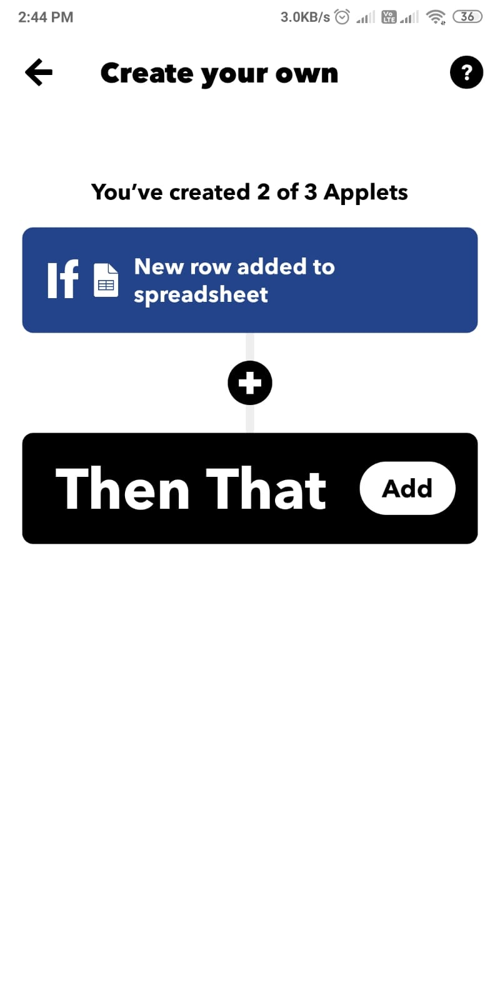
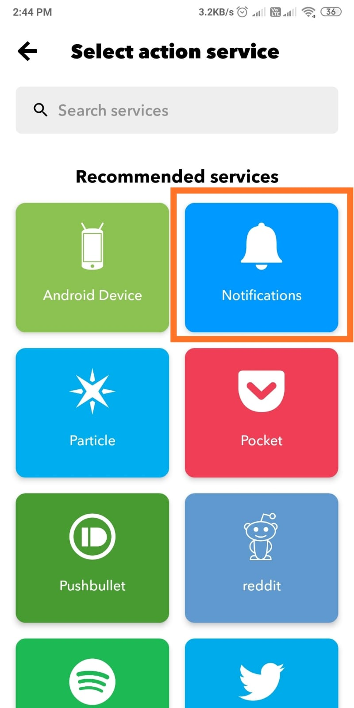
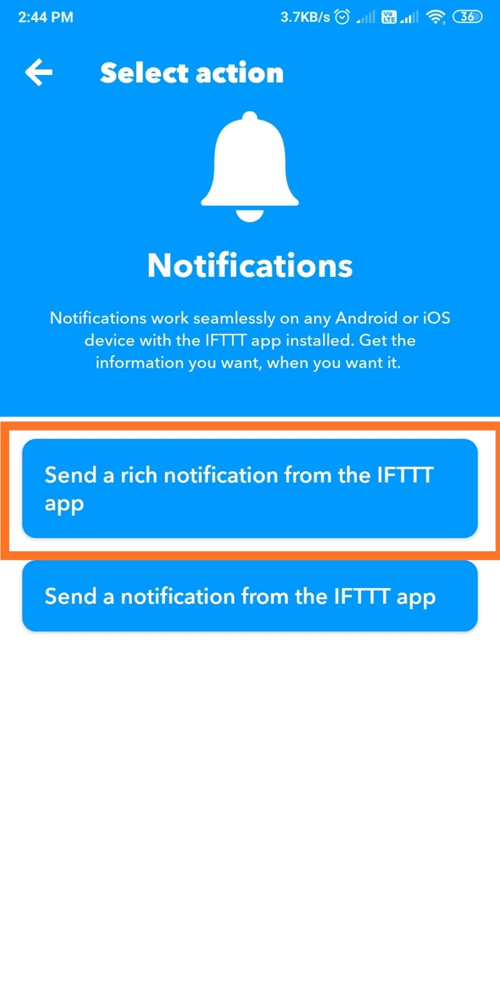
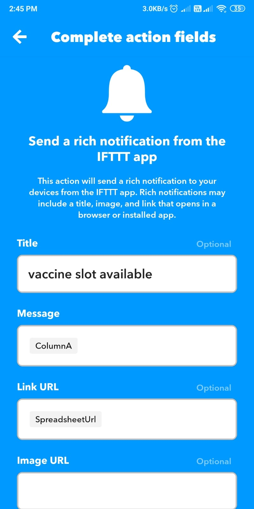

# cowin-notifier
## What this repository does

## Installation
```
pip3 install requests pygame gspread
```

## Inital Setup
1. Update your pincode on line number 16 of script.py
2. Create Google sheet & add your API credentials in `cowin-sheet-cred.json` <br /> To genrate Sheet API credentails refer this video https://www.youtube.com/watch?v=ct0xvw_Z0tU&t=617s
3. Install IFTTT App on your android or ios device <br /> https://ifttt.com/
4. Create IFTTT Applet to get notification on your device. <br /> Follow below steps 
  
  
  
  
  
  
  
  
## Run the script in Background
```
nohup python3 -u script.py &
```
